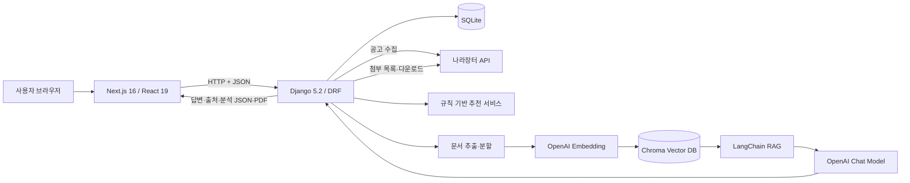
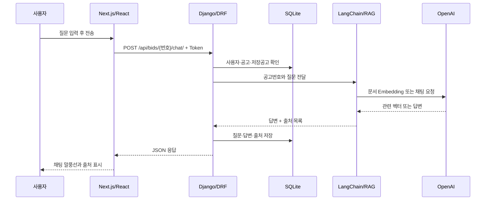
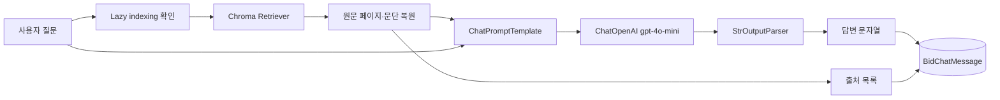
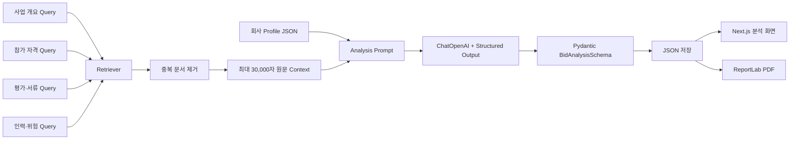

# BID2 프로젝트 구조 및 Prompt·LangChain·RAG 설계 문서

작성 기준: 현재 BID2 실제 코드  
프로젝트: 나라장터 입찰공고 수집·추천·저장·AI 문서 분석 서비스

---

## 0. 문서의 목적

이 문서는 BID2를 처음 보는 사람도 다음 내용을 이해할 수 있도록 작성했다.

- React와 Next.js가 화면에서 무엇을 담당하는가?
- Django는 언제, 왜 실행되며 어떤 일을 하는가?
- 나라장터 공고가 어떤 과정을 거쳐 화면에 나타나는가?
- 규칙 기반 추천과 OpenAI 기반 AI 분석은 무엇이 다른가?
- LangChain과 RAG는 프로젝트 안에서 어떤 역할을 하는가?
- 챗봇의 Persona, Prompt, Retriever, Output Parser는 어떻게 설계했는가?
- 단순한 초기 접근의 한계를 어떤 방식으로 보완했는가?

가장 중요한 결론은 다음과 같다.

> BID2에서 Next.js는 사용자가 보는 화면과 상호작용을 담당하고, Django는 데이터·인증·추천 규칙·문서 처리·OpenAI 호출을 담당한다. RAG는 나라장터 첨부 문서 중 질문과 관련된 부분을 먼저 찾은 뒤, 그 근거만 OpenAI 모델에 전달해 답변의 정확성과 출처 추적 가능성을 높이는 구조이다.

---

# Ⅰ. BID2 전체 프로젝트 이해

## 1. 프로젝트가 해결하려는 문제

나라장터에는 많은 입찰공고가 올라오며, 한 공고에도 공고문·제안요청서·과업지시서·각종 서식 등 여러 첨부파일이 존재한다. 사용자가 모든 공고와 첨부 문서를 직접 읽으려면 시간이 많이 들고, 참가 자격이나 제출 서류 같은 중요한 조건을 놓칠 수도 있다.

BID2는 이 문제를 다음 네 단계로 줄인다.

1. 나라장터 API에서 최근 공고를 자동으로 수집한다.
2. 회사가 입력한 키워드·지역·공고 유형·금액 조건에 맞는 공고를 추천한다.
3. 사용자가 관심 공고를 저장하고 상세 문서에 질문할 수 있게 한다.
4. 공고 문서와 회사 정보를 함께 비교하여 입찰 적합도 분석 보고서를 만든다.

여기서 추천공고의 `조건 일치도`는 규칙 기반 점수이고, 저장공고의 `AI 분석`은 OpenAI가 공고 문서와 회사정보를 비교한 결과이다. 두 점수는 목적과 계산 방식이 서로 다르다.

---

## 2. 전체 구성 한눈에 보기



각 구성요소를 사람의 역할에 비유하면 다음과 같다.

| 구성요소 | 비유 | 실제 역할 |
|---|---|---|
| React | 화면을 조작하는 직원 | 버튼, 입력창, 상태, 로딩, 결과 표시 |
| Next.js | 화면과 페이지를 구성하는 관리자 | URL별 페이지, 공통 레이아웃, 서버/클라이언트 렌더링 |
| Django | 업무 규칙을 처리하는 본사 | 인증, DB, API, 추천, 문서 처리, AI 호출 |
| DRF | 본사와 화면 사이의 접수 창구 | JSON 요청·응답, Token 인증 |
| SQLite | 업무 장부 | 회원, 회사, 공고, 저장공고, 추천, 채팅, 분석 저장 |
| LangChain | AI 작업 순서를 연결하는 조립 도구 | Prompt → Model → Parser 및 Retriever 연결 |
| Chroma | 의미 기반 문서 색인 | 질문과 의미가 가까운 Chunk 검색 |
| OpenAI Embedding | 문장의 의미를 숫자로 바꾸는 도구 | 문서와 질문을 같은 벡터 공간에서 비교 |
| OpenAI Chat Model | 검색된 근거를 읽고 답하는 분석가 | 챗봇 답변과 구조화된 분석 보고서 생성 |

---

## 3. React와 Next.js는 무엇을 하는가?

### 3.1 React의 역할

React는 사용자가 직접 보고 조작하는 UI를 컴포넌트 단위로 만든다. BID2에서는 다음과 같은 기능이 React 컴포넌트로 구현되어 있다.

- 로그인·회원가입 입력값과 오류 메시지 관리
- 회사정보 입력·수정
- 공고 검색어·키워드·지역 선택
- 저장 버튼, 상세 모달, 로딩 표시
- 추천공고와 저장공고 목록
- AI 채팅창의 질문·답변 상태
- AI 분석 결과와 PDF 다운로드 버튼

`useState`, `useEffect`처럼 브라우저 상태와 이벤트가 필요한 파일에는 `"use client"`가 선언되어 있다. 예를 들어 `BidChatWindow.tsx`는 질문 입력, 메시지 목록, 로딩 상태, 오류 상태를 브라우저에서 관리하므로 Client Component이다.

### 3.2 Next.js의 역할

Next.js는 React를 기반으로 URL별 페이지, 공통 레이아웃, 서버 렌더링과 클라이언트 렌더링을 구성한다. BID2는 App Router 구조를 사용한다.

예를 들어:

- `web/app/dashBoard/layout.tsx`: 대시보드 전체의 사이드바와 본문 틀
- `web/app/dashBoard/bidList/page.tsx`: 입찰공고 목록 URL과 검색 파라미터 처리
- `web/app/bidChat/page.tsx`: 별도 AI 채팅창 페이지
- `web/components/...`: 여러 페이지에서 재사용하는 화면 조각

입찰공고 목록은 Next.js Server Component인 `BidList.tsx`가 Django의 `/api/bids/`를 호출한다. `cache: "no-store"`를 사용하므로 저장된 오래된 화면을 재사용하지 않고 현재 DB 결과를 다시 가져온다.

반면 로그인 Token이나 브라우저 이벤트가 필요한 회사정보·저장공고·추천공고·AI 채팅은 Client Component가 Django에 직접 `fetch()` 요청을 보낸다.

### 3.3 Next.js가 DB를 직접 읽지 않는 이유

Next.js는 SQLite를 직접 조작하지 않는다. 모든 중요한 데이터 작업은 Django API를 거친다.

이렇게 나눈 이유는 다음과 같다.

- 인증과 데이터 검사를 한곳에서 처리할 수 있다.
- 브라우저에 DB 구조와 OpenAI API Key를 노출하지 않는다.
- 추천·문서 처리·AI 호출 같은 Python 로직을 Django에서 실행할 수 있다.
- 나중에 웹 이외의 앱이 생겨도 같은 API를 재사용할 수 있다.

---

## 4. Django는 언제, 왜 작동하는가?

Django 서버는 기본적으로 `http://127.0.0.1:8000`에서 실행되고, Next.js는 `http://localhost:3000`에서 실행된다. 사용자가 화면에서 데이터를 요청하거나 버튼을 누르면 Next.js가 Django API를 호출한다.

예를 들어 AI 채팅 질문을 보낼 때의 흐름은 다음과 같다.



### 4.1 Django가 담당하는 핵심 기능

1. **회원 인증**  
   DRF Token Authentication으로 로그인 사용자를 확인한다. 브라우저는 로그인 성공 시 받은 Token을 `Authorization: Token ...` 헤더에 담아 보낸다.

2. **데이터 저장**  
   `CompanyProfile`, `BidNotice`, `SavedBid`, `RecommendedBid`, `BidChatMessage`, `BidAnalysis` 모델을 SQLite에 저장한다.

3. **나라장터 공고 수집**  
   `sync_bids` 관리 명령이 최근 30일 공고를 가져와 최신 차수, 마감 상태, 금액, 지역, 업종 등을 정리한다.

4. **규칙 기반 추천**  
   회사의 찾는 공고 키워드, 제외 키워드, 공고 유형, 희망 지역, 금액 범위를 공고와 비교한다. 이 과정은 OpenAI가 아니라 Python 규칙으로 동작한다.

5. **RAG와 OpenAI 실행**  
   첨부파일을 내려받고 텍스트를 추출하며, Chroma 검색 결과를 Prompt에 넣어 OpenAI를 호출한다. API Key는 서버의 `.env`에만 둔다.

6. **결과 재사용**  
   Chroma 인덱스, 채팅 기록, AI 분석 JSON을 저장하여 불필요한 재처리와 OpenAI 비용을 줄인다.

### 4.2 CORS가 필요한 이유

브라우저 기준으로 `localhost:3000`과 `127.0.0.1:8000`은 서로 다른 Origin이다. Django의 `corsheaders`와 `CORS_ALLOWED_ORIGINS`는 BID2 프론트엔드에서 오는 요청을 허용한다.

---

## 5. 주요 데이터가 이동하는 과정

### 5.1 공고 수집

```text
나라장터 API
→ Django sync_bids
→ 필요한 필드 파싱
→ 같은 공고의 최신 차수 선택
→ 마감 여부 계산
→ BidNotice와 raw_data에 저장
→ Next.js 공고 목록에서 조회
```

목록과 추천에 자주 쓰는 값은 Django 필드로 정리하고, 나라장터 원본 값은 `raw_data` JSON에도 보관한다. 이 방식은 화면에 필요한 값을 빠르게 검색하면서도 원본 데이터 손실을 줄이기 위한 것이다.

### 5.2 회사 맞춤 추천

추천은 AI 판단이 아니라 설명 가능한 규칙 기반 계산이다.

- 공고명 첫 키워드 일치: 40점
- 공고명 추가 키워드: 개당 10점, 공고명 최대 60점
- 업종·공고기관·수요기관 첫 키워드: 10점
- 추가 키워드: 개당 5점, 최대 15점
- 공고 유형 일치: 10점
- 희망 지역 일치 또는 전국 참가 가능: 10점
- 희망 금액 범위 포함: 5점
- 30점 미만, 제외 키워드 포함, 유형·지역·금액 불일치는 제외

동점이면 공고명 일치 개수, 최신 등록일, 마감일 순으로 정렬한다. 추천공고는 회사와 공고 조건의 **일치도**이며 낙찰 확률이 아니다.

### 5.3 저장공고와 AI 기능

사용자가 공고를 저장하면 `SavedBid`가 회원과 공고를 연결한다. AI 채팅을 처음 열어도 채팅 기록 저장을 위해 `SavedBid`가 만들어질 수 있다. AI 분석은 저장된 공고와 회사 프로필이 모두 있어야 실행된다.

---

# Ⅱ. OpenAI 챗봇과 RAG 설정 설명

## 6. RAG란 무엇인가?

RAG는 Retrieval-Augmented Generation, 즉 **검색 증강 생성**이다.

일반적인 생성형 AI는 사용자가 질문하면 모델이 이미 학습한 지식만으로 답한다. 그러나 특정 나라장터 공고의 최신 첨부 문서는 모델이 미리 학습하지 않았고, 공고마다 내용도 다르다.

BID2의 RAG는 다음 순서로 해결한다.

1. 공고 첨부 문서를 텍스트로 변환한다.
2. 긴 문서를 작은 Chunk로 나눈다.
3. Chunk를 Embedding 벡터로 바꾸어 Chroma에 저장한다.
4. 질문도 같은 Embedding 모델로 벡터화한다.
5. 질문과 의미가 가까운 Chunk를 검색한다.
6. 검색된 근거와 질문을 OpenAI 채팅 모델에 함께 전달한다.
7. 모델이 제공된 문서 범위 안에서 답하고 출처 번호를 표시한다.

Embedding은 텍스트의 의미를 숫자 벡터로 표현한다. 단순 문자열 검색과 달리 정확히 같은 단어가 없어도 의미가 비슷한 문장을 찾는 데 사용할 수 있다.

---

## 7. 현재 OpenAI 설정

| 구분 | 현재 설정 | 선택 이유 |
|---|---|---|
| 채팅/분석 모델 | `gpt-4o-mini` | 수업에서 사용한 모델이며 비용과 응답 품질의 균형 고려 |
| Embedding 모델 | `text-embedding-3-small` | 문서 검색에 필요한 의미 벡터 생성, 상대적으로 낮은 비용 |
| temperature | `0` | 같은 근거에는 최대한 일관된 답을 생성하기 위해 사용 |
| 챗봇 최대 출력 | 800 completion tokens | 조건 누락을 줄이면서 과도한 비용 방지 |
| 분석 최대 출력 | 3,500 completion tokens | 여러 평가 항목을 구조화해 출력할 충분한 길이 확보 |
| 챗봇 최대 문맥 | 20,000자 | 원문을 충분히 제공하되 입력 비용과 길이 제한 관리 |
| 분석 최대 문맥 | 30,000자 | 사업·자격·평가·인력 등 넓은 분석 범위 확보 |
| API Key 위치 | `server/.env`의 `OPENAI_API_KEY` | Key를 브라우저와 Git에 노출하지 않기 위해 서버에서만 사용 |

Django 시작 시 `python-dotenv`가 `server/.env`를 환경변수로 읽는다. `langchain-openai`의 `ChatOpenAI`와 `OpenAIEmbeddings`가 이 환경변수에서 Key를 사용한다. 프론트엔드에는 OpenAI API Key가 전달되지 않는다.

---

## 8. 문서 전처리와 인덱싱 설정

### 8.1 지원 파일

현재 추출기는 다음 문서를 공통 LangChain `Document` 형태로 변환한다.

- PDF
- HWP, HWPX
- DOC, DOCX
- XLS, XLSX
- PPT, PPTX
- RTF, ODT
- TXT, CSV, XML
- ZIP 내부의 지원 문서

각 Document에는 파일명, 확장자, 페이지·문단·문서 구역, element index가 metadata로 저장된다. 이 정보가 나중에 출처 표시에 사용된다.

ZIP은 경로 조작과 실행파일 위험을 막기 위해 파일 수, 전체 용량, 개별 용량, 중첩 깊이, 확장자를 검사한다.

### 8.2 Chunk 설정

```python
RecursiveCharacterTextSplitter(
    chunk_size=500,
    chunk_overlap=100,
)
```

- `chunk_size=500`: 긴 문서를 약 500자 단위로 나눈다.
- `chunk_overlap=100`: 앞 Chunk의 마지막 약 100자를 다음 Chunk에도 겹친다.

겹침을 두는 이유는 중요한 문장이 Chunk 경계에서 반으로 잘리는 문제를 줄이기 위해서다. Chunk가 너무 크면 검색 결과가 넓고 불필요해지고, 너무 작으면 문맥이 끊긴다. 현재 값은 입찰 문서의 문장과 항목을 어느 정도 유지하면서 검색 단위를 작게 만들기 위한 절충값이다.

### 8.3 Chroma 저장 구조

- 공고번호별로 별도 Chroma 폴더와 collection을 사용한다.
- Chunk Embedding은 `text-embedding-3-small`로 생성한다.
- 이미 정상적인 Chroma DB가 있으면 다시 Embedding하지 않는다.
- `index_info.json`의 `INDEX_VERSION=2`를 확인해 현재 방식과 같은 인덱스만 재사용한다.

즉 최초 질문이나 분석에서는 첨부파일 다운로드·추출·Embedding 때문에 시간이 들 수 있지만, 같은 공고의 다음 질문부터는 저장된 Chroma를 재사용한다.

---

## 9. Retriever의 현재 설정

```python
MAX_SEARCH_CANDIDATES = 30
MIN_RELEVANCE_SCORE = 0.2
MIN_SEARCH_RESULTS = 5
```

질문 한 번의 검색 과정은 다음과 같다.

1. 해당 공고에 저장된 전체 Chunk 수를 확인한다.
2. 전체가 30개보다 많으면 관련도가 높은 최대 30개 후보를 검색한다.
3. 후보 중 relevance score가 0.2 이상인 Chunk를 모두 선택한다.
4. 0.2 이상인 Chunk가 5개보다 적으면 점수 상위 5개를 보완한다.
5. 저장된 전체 Chunk가 5개 미만이라면 실제 존재하는 결과까지만 반환된다.

### 9.1 0.2의 의미

`0.2`는 “정답 확률 20%”나 “AI 정확도 20%”가 아니다. Chroma가 질문 벡터와 문서 벡터의 거리를 바탕으로 변환해 돌려주는 **관련도 점수의 선택 기준**이다.

이 기준을 너무 높게 잡으면 참가 자격처럼 표현이 다른 중요한 문서가 빠질 수 있다. 반대로 너무 낮게 잡으면 관계없는 Chunk가 많이 들어가 Prompt가 길고 흐려진다. 현재는 0.2 이상을 동적으로 채택하되 최소 5개를 보장해 검색 누락 위험을 줄인다.

### 9.2 왜 고정 상위 5개만 쓰지 않았는가?

입찰 문서의 질문은 범위가 크게 다르다.

- “예산이 얼마인가?”는 관련 Chunk가 적어도 된다.
- “참가 자격을 모두 알려줘”는 여러 파일과 페이지에 조건이 흩어질 수 있다.

항상 상위 5개만 사용하면 두 번째 질문에서 면허·지역·실적·공동수급 조건 중 일부가 빠질 수 있다. 반대로 항상 30개를 모두 Prompt에 넣으면 무관한 내용과 비용이 증가한다.

그래서 현재 방식은 **최대 30개를 넓게 검색 → 0.2 기준으로 동적 선택 → 너무 적으면 최소 5개 보완** 구조이다.

---

## 10. Chunk 검색 후 원문 페이지를 복원하는 이유

Retriever가 찾은 것은 500자 Chunk이지만, 실제 OpenAI Prompt에는 가능하면 그 Chunk만 넣지 않는다. Chunk metadata의 `source`, `element_index`, `location`을 이용해 Chunk가 포함된 원본 페이지나 문단 전체를 다시 읽는다.

이렇게 한 이유는 다음과 같다.

- 참가 조건 목록의 앞부분이나 뒷부분이 Chunk 밖에 있을 수 있다.
- 표 제목과 실제 값이 서로 다른 Chunk로 나뉠 수 있다.
- 페이지 사이에 이어지는 문장을 함께 해석해야 할 수 있다.
- 사용자에게 파일명과 페이지·문단 위치를 출처로 보여줄 수 있다.

같은 원본 위치는 한 번만 넣어 중복을 제거하고, 챗봇은 최대 20,000자, 분석은 최대 30,000자까지만 문맥을 구성한다.

---

## 11. 개선 과정과 현재 구조가 된 이유

### 11.1 PDF 중심 처리에서 다중 문서 처리로 개선

초기 인덱스는 PDF 중심이었다. 실제 나라장터에는 HWP/HWPX, Word, Excel, PowerPoint, ZIP 등 다양한 형식이 있으므로 PDF만 처리하면 핵심 제안요청서나 서식을 놓칠 수 있었다.

현재는 `INDEX_VERSION=2`로 구분하고 여러 첨부파일과 압축파일 안의 문서까지 처리한다. 이전 방식의 Chroma가 남아 있으면 새 방식으로 다시 만든다.

### 11.2 고정된 소수 Chunk만 사용하는 문제 보완

고정 상위 결과만 사용하면 짧은 사실 질문에는 효율적이지만, 여러 조건을 빠짐없이 찾아야 하는 질문에는 부족할 수 있다.

현재는 최대 30개 후보와 0.2 관련도 기준을 함께 사용한다. 관련 문서가 많으면 기준을 통과한 결과를 넓게 쓰고, 결과가 적으면 상위 5개를 확보한다.

### 11.3 잘린 Chunk만 전달하는 문제 보완

500자 Chunk는 검색에는 좋지만 최종 답변 근거로는 문맥이 부족할 수 있다. 현재는 검색 위치를 찾는 열쇠로 Chunk를 사용하고, 답변 단계에서는 해당 원본 페이지·문단 전체를 복원한다.

### 11.4 OpenAI 클라이언트 생성 시점 개선

이전 코드에서는 모듈이 import될 때 `ChatOpenAI` 객체가 바로 만들어졌다. 이 구조는 AI 기능을 실행하지 않는 Django 테스트에서도 `OPENAI_API_KEY`가 없으면 import 단계에서 실패할 수 있었다.

현재는 `build_chat_chain()`과 `build_analysis_chain()` 안에서 실제 AI 호출 직전에 클라이언트를 만든다. 이를 Lazy initialization이라고 볼 수 있다.

효과는 다음과 같다.

- API Key가 없어도 AI와 무관한 Django 기능과 테스트를 실행할 수 있다.
- 실제 사용 시점에만 OpenAI 관련 객체가 생성된다.
- 설정 오류의 영향 범위가 AI 요청으로 제한된다.

### 11.5 반복 비용 방지

- 같은 공고의 정상 Chroma 인덱스 재사용
- 최초 분석 결과를 `BidAnalysis`에 저장하고 다음 요청에서 재사용
- 채팅과 분석의 최대 입력 글자 수 제한
- 최대 출력 token 제한
- 실패한 답변은 채팅 기록에 저장하지 않음

### 11.6 자유 형식 분석에서 구조화 출력으로 개선

일반 문자열만 요청하면 응답마다 필드 이름이나 목록 구조가 달라질 수 있다. 현재 AI 분석은 Pydantic `BidAnalysisSchema`를 사용하여 적합도, 참가 자격, 서류, 강점, 위험, 실행 전략 등을 일정한 JSON 구조로 받는다. 덕분에 Next.js 화면과 PDF가 안정적으로 같은 필드를 사용할 수 있다.

---

## 12. 현재 챗봇이 기억하는 것과 기억하지 않는 것

채팅 기록은 `BidChatMessage`에 사용자·공고별로 저장되고, 채팅창을 다시 열면 이전 대화를 화면에 보여준다.

그러나 현재 `ask_bid_question()`이 OpenAI에 전달하는 값은 다음 두 개이다.

- 현재 질문 `question`
- 현재 질문으로 검색한 문서 `context`

이전 대화 내용은 다음 질문의 Prompt에 포함되지 않는다. 따라서 현재 구조는 **대화 기록 저장 기능은 있지만 LangChain 대화 Memory는 없는 독립 질문형 RAG**이다.

예를 들어 첫 질문에서 “이 공고”를 설명한 뒤 다음 질문으로 “그중 두 번째 조건은?”이라고 하면, 모델은 이전 답변을 직접 전달받지 않기 때문에 의도를 완전히 이해하지 못할 수 있다. 향후 개선 시 최근 대화 일부를 Prompt에 넣거나 질문을 독립형 문장으로 재작성하는 단계를 추가할 수 있다.

---

# ② Prompt 설계 문서

## 13. Persona

### 13.1 AI 챗봇 Persona

> 너는 나라장터 입찰공고 문서를 분석하는 AI 챗봇입니다.

이 Persona는 일반 잡담형 챗봇이 아니라 특정 공고 문서를 근거로 입찰 실무 질문에 답하는 역할을 부여한다.

주요 행동 특성은 다음과 같다.

- 나라장터 첨부 문서를 우선 근거로 사용한다.
- 문서에 없는 사실은 추측하지 않는다.
- 참가 자격처럼 여러 조건이 있으면 빠짐없이 정리한다.
- 사용자가 원문을 확인할 수 있도록 출처 번호를 표시한다.
- 한국어로 간결하고 실무적으로 답한다.

### 13.2 AI 분석 Persona

> 너는 나라장터 공고문과 회사 정보를 대조하는 입찰 검토 전문가입니다.

챗봇이 “문서 질문에 답하는 역할”이라면 AI 분석은 “공고 조건과 회사 역량을 대조해 보고서를 작성하는 역할”이다.

---

## 14. System Prompt

### 14.1 챗봇용 Prompt 내용

```text
[역할]
너는 나라장터 입찰공고 문서를 분석하는 AI 챗봇입니다.

[답변 원칙]
- 반드시 아래 검색 문서만 근거로 답변합니다.
- 문서에 없는 내용은 추측하지 않습니다.
- 근거가 부족하면 "제공된 문서에서 확인할 수 없습니다."라고 답합니다.
- 참가 자격처럼 여러 조건이 나열된 질문은 모든 조건을 빠짐없이 정리합니다.
- 문장이 페이지 사이에 이어지면 앞뒤 페이지 내용을 연결해서 해석합니다.
- 핵심 내용 뒤에는 [출처 번호]를 표시합니다.
- 한국어로 간결하고 명확하게 답합니다.

[검색 문서]
{context}

[사용자 질문]
{question}

[답변]
```

`{context}`에는 Retriever로 찾은 공고 원문과 `[출처 1: 파일명, 위치]` 같은 출처 머리말이 들어간다. `{question}`에는 사용자가 입력한 현재 질문이 들어간다.

### 14.2 AI 분석용 Prompt 핵심 내용

```text
[역할]
너는 나라장터 공고문과 회사 정보를 대조하는 입찰 검토 전문가입니다.

[중요 원칙]
- 검색 문서와 회사 정보만 근거로 작성합니다.
- 적합도는 낙찰 확률이 아니라 공고 조건과 회사 역량의 일치 정도입니다.
- 회사 입력값이 비어 있으면 "회사정보 보완 필요"로 표시합니다.
- 공고 근거가 없으면 "공고문 확인 필요"로 표시합니다.
- 필수 자격 미충족 가능성이 있으면 높은 점수를 주지 않습니다.
- 근거가 있는 항목에는 source_numbers를 기록합니다.
- 5개 평가 항목의 최대 점수 합계를 100점으로 맞춥니다.

[회사 정보]
{company_context}

[공고 검색 문서]
{document_context}
```

평가 항목은 업종/분야 20점, 기업 역량·규모 20점, 지역 10점, 참가 자격·필수 요건 30점, 사업 내용·실적 20점으로 구성한다.

### 14.3 기술적으로 알아둘 점

현재 코드는 `ChatPromptTemplate.from_template()`을 사용한다. 내용에는 역할과 원칙이 있으므로 기능적으로 System Prompt 역할을 하지만, LangChain 메시지 role을 엄밀히 나누면 하나의 템플릿 메시지로 전달되는 구조이다.

실제 `system`과 `human` role을 명확히 분리하려면 향후 다음 형태로 바꿀 수 있다.

```python
ChatPromptTemplate.from_messages([
    ("system", "역할과 답변 원칙"),
    ("human", "[검색 문서]\n{context}\n\n[사용자 질문]\n{question}"),
])
```

과제 설명에서는 현재 Prompt의 `[역할]`과 `[답변 원칙]` 부분을 System Prompt로 설명할 수 있지만, 코드상 메시지 role의 차이는 위와 같이 구분해서 이해하는 것이 정확하다.

---

## 15. Prompt 설계 의도

| Prompt 요소 | 설계 의도 |
|---|---|
| Persona 지정 | 일반 대화가 아니라 입찰 문서 분석 역할로 범위를 제한 |
| 검색 문서만 근거 | 모델의 일반 지식이나 추측으로 잘못 답하는 현상 감소 |
| 확인할 수 없음 문구 | 근거 부족을 숨기지 않고 사용자에게 알림 |
| 모든 조건 정리 | 참가 자격·제출 서류 일부 누락 방지 |
| 페이지 연결 해석 | Chunk와 페이지 경계로 문장이 잘리는 문제 완화 |
| 출처 번호 | 사용자가 실제 파일·페이지를 다시 확인할 수 있게 함 |
| 한국어·간결성 | 입찰 담당자가 빠르게 읽을 수 있는 결과 제공 |
| temperature 0 | 답변의 변동성을 줄이고 일관성 강화 |
| 분석 점수는 낙찰 확률이 아님 | 사용자가 AI 점수를 실제 낙찰 가능성으로 오해하지 않게 함 |
| 회사정보 보완/공고문 확인 구분 | 정보 부족의 원인이 사용자 입력인지 문서 검색인지 구별 |
| Pydantic Schema | 프론트 화면과 PDF가 안정적으로 사용할 일정한 구조 보장 |

Prompt만으로 환각을 완전히 제거할 수는 없다. BID2는 Prompt 규칙뿐 아니라 Retriever, 원문 복원, 출처 metadata, 구조화 출력, 입력 길이 제한을 함께 사용해 신뢰성을 높인다.

---

# ③ LangChain 구성 설명

## 16. Chain 구조

### 16.1 챗봇 Chain



LCEL 표현은 다음과 같다.

```python
prompt | model | StrOutputParser()
```

Retriever는 이 세 요소 밖에서 먼저 실행되어 `{context}`를 만들고, 완성된 context와 question이 Chain의 입력값으로 전달된다.

### 16.2 AI 분석 Chain



분석은 사용자 질문 하나에 의존하지 않고 다음 네 개의 검색 Query를 사용한다.

1. 사업 개요·발주기관·예산·마감·계약 기간·주요 과업
2. 참가 자격·면허·인증·실적·지역·공동수급
3. 제출 서류·기술평가·가격평가·배점
4. 요구 인력·자격·계약 조건·위험·과업 범위

각 Query 결과는 파일, element index, 위치, 본문을 기준으로 중복 제거한다. 한 번의 질문 검색보다 입찰 검토에 필요한 영역을 고르게 찾기 위한 설계이다.

---

## 17. Prompt

LangChain의 `ChatPromptTemplate`은 고정 지시문과 실행 시 달라지는 값을 결합한다.

챗봇 입력:

```python
{
    "context": 검색된_공고_원문,
    "question": 사용자_질문,
}
```

분석 입력:

```python
{
    "company_context": 회사정보_JSON,
    "document_context": 검색된_공고_원문,
}
```

회사정보 JSON에는 회사명, 주소, 업종, 기업유형, 직원 수, 자본금, 매출, 주요 사업, 보유 역량, 인증·자격, 실적, 찾는 공고 키워드, 희망지역이 포함된다.

---

## 18. Retriever

Retriever는 “질문에 답할 가능성이 높은 문서 조각”을 찾는다.

구성:

- Vector Store: Chroma
- Embedding: OpenAI `text-embedding-3-small`
- 검색 후보: 최대 30개
- 최소 관련도: 0.2
- 최소 보완 결과: 상위 5개
- 검색 단위: 500자 Chunk, 100자 overlap
- 최종 Prompt 단위: 검색 Chunk가 속한 원본 페이지·문단

Retriever의 결과는 최종 답변이 아니다. Retriever는 근거 후보를 찾고, Chat Model이 그 근거를 읽어 자연어 답변을 만든다.

---

## 19. Output Parser

### 19.1 챗봇: StrOutputParser

`ChatOpenAI`의 메시지 객체에서 최종 텍스트만 꺼내 일반 문자열로 바꾼다.

```python
prompt | model | StrOutputParser()
```

반환 결과:

```json
{
  "answer": "문서 근거에 따른 답변 [출처 1]",
  "sources": [
    {
      "number": 1,
      "file_name": "공고문.pdf",
      "location": "3페이지"
    }
  ]
}
```

`sources`는 StrOutputParser가 만드는 것이 아니라, Django가 검색된 Document metadata를 이용해 별도로 구성한다.

### 19.2 AI 분석: Pydantic Structured Output

AI 분석은 단순 문자열이 아니라 `BidAnalysisSchema` 구조로 받는다.

주요 필드:

- `summary`
- `fit_score` 0~100
- `recommendation`: 참여 검토 / 조건부 검토 / 참여 주의
- 사업 개요
- 5개 평가 항목과 점수
- 참가 자격, 제출 서류, 기술·가격 평가
- 주요 과업, 요구 인력, 인증·실적
- 강점, 위험, 확인사항, 실행 전략
- 각 평가 항목의 `source_numbers`

LangChain의 `.with_structured_output(BidAnalysisSchema)`가 모델 출력이 이 구조를 따르도록 하고, 결과는 Pydantic 객체로 받은 뒤 `model_dump()`로 JSON 저장한다.

---

## 20. LangChain을 사용한 이유

OpenAI SDK를 직접 호출해도 답변 생성은 가능하다. 하지만 BID2는 문서 Loader, Text Splitter, Chroma, Embedding, Prompt Template, Model, Parser를 함께 사용한다.

LangChain을 사용한 이유는 다음과 같다.

- 서로 다른 문서 형식을 `Document`로 통일할 수 있다.
- Chunk 분할과 metadata 유지가 쉽다.
- Chroma와 OpenAI Embedding 연결을 재사용할 수 있다.
- Prompt → Model → Parser 흐름을 LCEL로 명확하게 표현할 수 있다.
- 챗봇의 문자열 출력과 분석의 구조화 출력을 목적에 따라 나눌 수 있다.
- 나중에 Retriever나 모델을 교체하기 쉽다.

LangChain이 답변 정확도를 자동으로 보장하는 것은 아니다. 정확도는 문서 추출 품질, Chunk 크기, 검색 기준, Prompt, 모델, 출처 검증을 함께 조정해야 한다.

---

## 21. 선생님께 설명할 때 사용할 수 있는 요약

> BID2는 Next.js와 React로 사용자 화면을 만들고, Django REST Framework로 인증·DB·나라장터 수집·추천·AI API를 구현한 분리형 웹 애플리케이션입니다. 공고 추천은 설명 가능한 Python 규칙 기반이며, 첨부 문서 질문과 회사 적합도 분석에는 LangChain RAG를 사용했습니다. 첨부 문서를 500자 Chunk와 100자 overlap으로 나눈 뒤 `text-embedding-3-small`로 Embedding하여 공고별 Chroma에 저장합니다. 질문 시 최대 30개 후보를 검색하고 관련도 0.2 이상을 선택하며, 결과가 부족하면 상위 5개를 보완합니다. 검색 Chunk만 그대로 쓰지 않고 해당 원문 페이지나 문단 전체를 복원해 최대 20,000자까지 `gpt-4o-mini`에 전달합니다. 챗봇은 `ChatPromptTemplate → ChatOpenAI → StrOutputParser` 구조이고, AI 분석은 네 종류의 검색 Query와 회사정보를 결합한 뒤 Pydantic 구조화 출력으로 JSON 보고서를 만듭니다. API Key는 Django 서버의 `.env`에서만 관리하며, Chroma와 분석 결과를 재사용해 비용을 줄였습니다.

---

## 22. 현재 한계와 향후 개선 방향

1. **대화 Memory 추가**  
   현재는 이전 대화를 화면에 보여주지만 다음 질문 Prompt에는 넣지 않는다. 최근 대화 요약 또는 질문 재작성 Chain을 추가할 수 있다.

2. **검색 평가 데이터 구축**  
   0.2 threshold와 500/100 Chunk 설정을 실제 질문·정답 세트로 평가하여 조정할 수 있다.

3. **출처 번호 자동 검증**  
   모델이 답변에 작성한 `[출처 번호]`가 실제 sources 범위와 일치하는지 후처리 검증을 추가할 수 있다.

4. **System/Human 메시지 role 분리**  
   현재 결합 템플릿을 실제 system 지시문과 human 질문 메시지로 명확히 나눌 수 있다.

5. **문서별 가중치와 재정렬**  
   공고문, 제안요청서, 과업지시서의 중요도와 keyword/semantic reranking을 함께 적용할 수 있다.

6. **비동기 작업 처리**  
   문서 다운로드·추출·Embedding·분석을 작업 Queue로 분리하면 긴 요청에서도 더 안정적인 UI를 제공할 수 있다.

7. **운영 환경 보강**  
   SQLite를 PostgreSQL로 교체하고, DEBUG·SECRET_KEY·허용 Host·HTTPS·로깅·rate limit을 운영 환경에 맞게 구성할 수 있다.

---

## 23. 코드 위치 안내

| 내용 | 코드 위치 |
|---|---|
| 챗봇 Prompt·Chain·원문 복원 | `server/bids/services/rag/chatbot.py` |
| Retriever와 30/0.2/5 설정 | `server/bids/services/rag/retriever.py` |
| 500/100 Chunk 분할 | `server/bids/services/rag/split_documents.py` |
| Embedding과 Chroma | `server/bids/services/rag/vector_store.py` |
| Lazy indexing과 INDEX_VERSION | `server/bids/services/rag/prepare_docs_for_ai.py` |
| 파일 형식별 텍스트 추출 | `server/bids/services/rag/extract_document.py` |
| AI 분석 Prompt·Pydantic Schema | `server/bids/services/rag/analysis.py` |
| 채팅·분석 Django API | `server/bids/views.py` |
| Django URL | `server/bids/urls.py` |
| DB 모델 | `server/bids/models.py` |
| Next.js 채팅 UI | `web/components/chat/BidChatWindow.tsx` |
| Next.js 분석 UI | `web/components/analysis/BidAnalysisReport.tsx` |
| 규칙 기반 추천 | `server/bids/services/recommendation.py` |

---

## 24. 참고 자료

- OpenAI Embeddings Guide: https://developers.openai.com/api/docs/guides/embeddings
- OpenAI Prompt Engineering Guide: https://developers.openai.com/api/docs/guides/prompt-engineering
- OpenAI Structured Outputs Guide: https://developers.openai.com/api/docs/guides/structured-outputs
- Django Documentation: https://docs.djangoproject.com/en/5.2/
- Next.js Documentation: https://nextjs.org/docs
- LangChain Python Documentation: https://python.langchain.com/docs/

> 참고: 위 자료는 개념 확인용이며, 이 문서에 기록된 모델명, Chunk 크기, threshold, 후보 수, 최대 문맥 길이 등 실제 설정값은 BID2 로컬 코드를 기준으로 작성했다.
